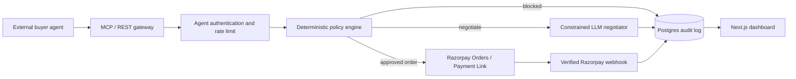

# AgentGate Technical Implementation Plan

## 1. Goal and delivery boundary

Build a test-mode Agent Commerce Gateway that lets an external MCP-capable buyer agent discover a merchant catalog, negotiate within hard rules, create a Razorpay order only after deterministic policy approval, and inspect a complete audit trail.

The delivery is a single-demo-merchant MVP. It is not a multi-tenant production launch, a general marketplace, or an autonomous payment product. All payment activity uses Razorpay test mode and all monetary values are integer paise.

### Definition of done

- An MCP client can call `search_catalog`, `get_product`, `negotiate_offer`, `create_order`, and `get_order_status` using a scoped agent credential.
- No Razorpay order can be created except through the deterministic policy engine.
- A successful Razorpay test payment changes the local order state through a verified webhook.
- A policy violation is blocked and logged before Razorpay is called.
- A Razorpay payment failure is verified, stored, and shown as a recoverable outcome.
- The dashboard provides live audit history and an order-level evidence trail.
- The repository includes migrations, seed data, API/MCP documentation, tests, a repeatable end-to-end demo script, and deployment instructions.

## 2. Architecture and implementation decisions

Use a TypeScript monorepo with these boundaries:

```text
apps/
  dashboard/          Next.js App Router merchant and audit UI
  demo-buyer-agent/   MCP client used only to drive the demo
packages/
  gateway/            Fastify HTTP API, MCP transport, auth, policy, webhooks
  db/                 Drizzle schema, migrations, seed/query repositories
  razorpay-adapter/   Narrow wrapper around Razorpay Orders and payment links
  shared/             Zod schemas, amount helpers, domain types
scripts/
  demo-e2e.ts         Repeatable A -> B -> C1 -> C2 scenario runner
docs/
  mcp-tools.md        Published tool contracts and examples
  architecture.md     Diagram, trust boundaries, and decision record
```

Core flow:



Implementation choices:

- **Gateway:** Fastify plus the official MCP TypeScript SDK. Fastify makes raw-body webhook handling and request validation explicit; expose REST endpoints alongside an MCP transport so the dashboard and demo script can use the same domain services.
- **Validation:** Zod schemas at every process boundary. MCP schemas, REST request bodies, environment values, Razorpay webhook payloads, and LLM JSON responses are validated before use.
- **Database:** Supabase Postgres with Drizzle ORM/migrations. Keep a `merchant_id` in all merchant-owned tables even though the MVP seeds only one merchant.
- **Dashboard:** Next.js + Tailwind/shadcn UI. The dashboard calls gateway read/write APIs; it never receives Razorpay secrets.
- **LLM:** Groq through the OpenAI-compatible SDK. It is restricted to forming a negotiation proposal; code computes the permitted price range and validates the response again.
- **Payments:** Razorpay Node SDK in test mode only. The adapter is the sole integration point allowed to call Razorpay.
- **Hosting:** Vercel for dashboard, Render for gateway, Supabase for Postgres. Configure a `/healthz` endpoint and an uptime ping before webhook testing.

## 3. Work sequence

### Step 0 — Bootstrap the workspace and delivery controls

1. Create the monorepo workspace, TypeScript base config, package manager workspace file, linting, formatting, and test runner.
2. Add `.gitignore`, `.env.example`, and environment validation at process start.
3. Define runtime environments: local, test, and production/demo. Reject startup if secrets are absent in an environment that needs them.
4. Add CI to run type checking, linting, unit tests, and build for all packages.
5. Create `README.md`, `docs/architecture.md`, and `docs/mcp-tools.md` as living documents.

**Exit criteria:** `install`, `lint`, `typecheck`, `test`, and `build` work from a clean checkout; no secret-bearing file is tracked.

### Step 1 — Establish the database and domain model

1. Provision Supabase Postgres and set `DATABASE_URL` locally and in hosting environments.
2. Implement migrations for the PRD tables: `merchants`, `policies`, `catalog_items`, `agents`, `negotiations`, `orders`, and `audit_log`.
3. Add two supporting tables required for reliable operation:
   - `webhook_events`: unique Razorpay event ID, event type, payload hash, received/processed timestamps, and processing result; this is the durable idempotency record.
   - `order_approvals`: order ID, approval status, approver identity, decision time, and optional comment; this makes the human-approval state actionable rather than merely a status string.
4. Add constraints and indexes: non-negative paise/stock checks, unique `(merchant_id, sku)`, unique Razorpay order ID, unique webhook event ID, indexes for audit time, agent orders, merchant catalog, and pending approvals.
5. Build repository methods that always scope reads/writes by `merchant_id` and avoid raw SQL in route handlers.
6. Seed one merchant, one active demo agent, a policy, and 5–10 SKUs spanning allowed/disallowed categories and reversible/non-reversible goods. Seed data must reproduce the documented demo limits.
7. Add a seed reset command usable only in local/test environments.

**Exit criteria:** migrations apply to an empty database; seed data creates the demo merchant and catalog; domain tests confirm integer-paise storage and constraints.

### Step 2 — Create shared contracts, authentication, and audit primitives

1. Define shared Zod/domain schemas for catalog items, policy decisions, negotiation inputs/results, order statuses, audit records, Razorpay adapter results, and tool inputs/outputs.
2. Implement paise helpers (`rupeesToPaise`, display formatting, safe multiplication) and prohibit floating-point arithmetic in money-related modules.
3. Generate agent API keys once, display plaintext only at creation, and persist an Argon2id/bcrypt hash plus key prefix for lookup. Never persist or log the plaintext value.
4. Implement agent authentication middleware: parse bearer/API-key header, locate by prefix, verify in constant time through the password-hash library, enforce active status and merchant scope.
5. Add per-agent/IP rate limits to all public gateway routes and MCP connections.
6. Implement an append-only audit service. Every public action writes a record with correlation ID, actor/agent, entity, sanitized input, output, policy result, and timestamp. Redact credentials, payment instrument data, and unnecessary personal data.
7. Add a request correlation ID middleware and return it in gateway responses so dashboard records and logs can be connected.

**Exit criteria:** unauthorized/revoked agents are rejected; valid calls are merchant-scoped; every tested route produces a sanitized audit record with a correlation ID.

### Step 3 — Implement the deterministic policy engine

1. Write a side-effect-free `evaluateNegotiation` function that checks SKU existence/stock, agent status, allowed category, positive target price, and SKU discount floor.
2. Write a side-effect-free `evaluateOrder` function that checks, in a fixed and documented order:
   - SKU existence, stock, and quantity;
   - agent active status;
   - category allow-list;
   - agreed unit price at/above SKU discount floor and at/below listed price;
   - maximum transaction value;
   - current-day spend plus requested total against daily spend cap;
   - orders in the preceding hour against velocity cap;
   - approval threshold, tightened for non-reversible products.
3. Return a complete `PolicyDecision`, including all evaluated checks, first failing rule, limits, attempted values, decision version, and `requiresHumanApproval`.
4. Query current-day spend only from qualifying in-flight/paid order states defined explicitly in code. Document whether failed and policy-blocked orders count (they should not).
5. Use a database transaction or appropriate locking strategy around spend/velocity read plus order creation to prevent concurrent requests from bypassing caps.
6. Persist every allow/deny result before calling the LLM or Razorpay. Denials must never be silent.
7. Add unit tests for T1–T7 and boundary tests: exactly at cap, one paise over, zero/negative quantities, stale/unknown SKU, stock exhaustion, and non-reversible approval threshold.

**Exit criteria:** policy tests pass; a code search shows no Razorpay call outside the policy-approved order service; policy responses name the exact rule and evidence.

### Step 4 — Build catalog and order gateway services

1. Implement catalog services for list/search and product lookup, limited to active/in-stock merchant inventory as appropriate.
2. Expose REST endpoints for the dashboard and MCP-compatible tool handlers using the same application services:
   - `search_catalog(query, max_price_paise?, category?)`
   - `get_product(sku)`
   - `negotiate_offer(sku, target_price_paise, agent_id)`
   - `create_order(sku, quantity, agreed_price_paise, agent_id)`
   - `get_order_status(order_id)`
3. Authenticate public tool calls from the credential, not a caller-supplied agent ID. If the tool contract retains `agent_id` for clarity, assert it equals the authenticated identity.
4. Return stable, machine-readable error shapes such as `{ allowed:false, reason, policy_rule, limit_paise?, attempted_paise?, correlation_id }`.
5. Create the official MCP tool registration from the shared Zod contracts. Choose and document one supported transport (Streamable HTTP is preferred for remote clients); add a local stdio adapter only if it does not delay the core path.
6. Publish exact input/output examples and error semantics in `docs/mcp-tools.md`.
7. Add integration tests for each endpoint/tool and for tenant/agent isolation.

**Exit criteria:** an MCP inspector or small client script can invoke all five tools and receives contracts matching the documentation.

### Step 5 — Add constrained negotiation

1. Before invoking the LLM, fetch the item and calculate allowed price bounds in code: SKU floor through listed price.
2. Sanitize catalog and buyer-provided text as untrusted data. Do not interpolate arbitrary content into privileged prompt instructions.
3. Invoke Groq with a short system prompt that asks only for JSON `{ offered_price_paise, reason }`; provide only the required product facts and numeric bounds.
4. Parse LLM output with Zod. On timeout, malformed JSON, or out-of-range price, use a deterministic fallback offer (for example, the computed floor/listed price policy) and audit the fallback cause.
5. Re-run the offered price through deterministic negotiation validation before returning it. The model never calls `create_order` and cannot change policy fields.
6. Store each negotiation request/result and audit the proposal, validation outcome, model/fallback metadata, and correlation ID.
7. Add prompt-injection and malformed-output tests that prove a model response cannot move an offer outside code-computed bounds.

**Exit criteria:** valid negotiation returns structured JSON within bounds; below-floor requests return a structured rejection or compliant fallback; malformed LLM output degrades safely and visibly.

### Step 6 — Integrate Razorpay and human approval

1. Implement `razorpay-adapter` with typed methods for creating an order and the selected checkout mechanism (Payment Link or checkout session). Include receipt and notes containing internal order/agent/SKU references, never secrets.
2. In `create_order`, evaluate policy, write the local order/policy snapshot, and then:
   - return `policy_blocked` if denied;
   - create `awaiting_approval` plus an approval record if required;
   - otherwise create the Razorpay order/link through the adapter and persist its external ID/link.
3. Add a merchant-only approval endpoint/action. Approval re-checks the policy and order state before Razorpay creation, so old approvals cannot bypass later policy changes or duplicated actions.
4. Ensure only the order application service imports the Razorpay adapter. Do not give the dashboard, MCP registration, or LLM direct adapter access.
5. Use idempotency-safe local order creation: a repeated client request with the same idempotency key returns the existing outcome rather than creating another Razorpay order.
6. Exercise a manual test-mode purchase using `success@razorpay` and capture the resulting local/external IDs in a developer runbook.

**Exit criteria:** a policy-approved order yields a real Razorpay test-mode checkout URL; blocked/approval-required orders never call Razorpay; repeated requests do not duplicate external orders.

### Step 7 — Implement secure, idempotent Razorpay webhooks

1. Mount `/webhooks/razorpay` with raw-body handling before JSON parsing. Keep the raw bytes available for verification.
2. Verify `x-razorpay-signature` using HMAC-SHA256 and `RAZORPAY_WEBHOOK_SECRET`; return 400 and write no business-state updates on a mismatch.
3. Parse only verified payloads and persist the Razorpay event ID in `webhook_events` under a unique constraint before processing. Treat an existing event as a successful idempotent no-op.
4. Map relevant verified events to monotonic local order transitions: pending/authorized -> paid for captured/paid events; pending/authorized -> failed for failed events. Never allow late or duplicate events to regress a terminal state.
5. Write a first-class audit record for received, ignored, processed, and failed webhook handling. Store sanitized payload metadata plus event ID.
6. Add a reconciliation/status-poll fallback that fetches Razorpay state through the adapter if a webhook is delayed; audit the reconciled result distinctly.
7. Test valid signatures, tampered signatures (T8), duplicate delivery (T9), out-of-order events, and the `failure@razorpay` payment decline (T10).

**Exit criteria:** verified success transitions the order to `paid`; `failure@razorpay` transitions it to `failed`; invalid/duplicate/out-of-order events cannot create duplicate or regressed business records.

### Step 8 — Build the merchant and audit dashboard

1. Implement protected merchant-admin access suitable for the demo (local password/session or Supabase auth). Keep it separate from buyer-agent credentials.
2. Build `/dashboard` with merchant policy form and catalog CRUD. Validate input server-side, persist policy versions, and show a permanent test-mode banner.
3. Build `/agents` with agent list, key-creation flow, status/suspend toggle, and no ability to retrieve an existing plaintext key.
4. Build `/audit` as a reverse-chronological, polling timeline with filters for agent, entity type, action, decision, and date. Refresh every few seconds and retain query parameters in the URL.
5. Build `/orders/[id]` as the evidence screen: item/price, negotiation, all policy checks, approval record, Razorpay reference, webhook events, current state, correlation IDs, and raw sanitized JSON.
6. Add top-level demo metrics: test-mode GMV, completed orders, negotiation count, policy blocks, payment failures, and average negotiation-to-terminal time.
7. Use human-readable timeline labels while retaining raw JSON and exact policy rule names on drill-down.

**Exit criteria:** a running demo visibly adds audit records without manual refresh; a reviewer can reconstruct an order from request through payment outcome from one page.

### Step 9 — Automate the buyer journey and failure recovery

1. Build the demo buyer agent as an MCP client with a bounded budget and a deterministic scripted scenario. An optional LLM can select products, but the scripted test must not depend on non-deterministic narration.
2. Implement `scripts/demo-e2e.ts` to seed/reset a known merchant and run:
   - A: catalog discovery and merchant configuration verification;
   - B: allowed search -> negotiation -> policy-approved purchase -> successful test payment/webhook;
   - C1: an over-cap or below-floor request blocked before Razorpay, followed by a compliant fallback;
   - C2: policy-approved order paid with `failure@razorpay`, followed by a logged failed state and retry/fallback guidance.
3. Give the script explicit assertions against API responses, database state, audit entries, and Razorpay reference presence. Exit non-zero on any mismatch.
4. Make each scenario use isolated idempotency keys/test data so repeated runs remain reliable.
5. Run the script daily after the initial money path is complete and before every deployment/demo recording.

**Exit criteria:** one command demonstrates both success and both failure layers from a clean seed; it passes twice consecutively against the deployed test environment.

### Step 10 — Security, reliability, deployment, and documentation

1. Complete the security checklist: server-only Razorpay/Groq secrets, hashed/revocable agent keys, raw-body signature verification, event/order idempotency, rate limits, input validation, prompt-injection boundaries, paise-only arithmetic, `.env` exclusion, and test-mode banner.
2. Add structured logs with correlation IDs and redaction; configure error reporting only if it can be done without expanding scope or exposing sensitive payloads.
3. Deploy the gateway to Render, dashboard to Vercel, and configure environment variables in each. Set `AGENTGATE_BASE_URL` to the public gateway URL.
4. Configure Razorpay test-mode webhook delivery to the deployed raw-body endpoint. Verify public reachability before UI polish.
5. Configure an external 5-minute health ping to `/healthz` to reduce Render cold starts. Verify it on the morning of the demo.
6. Load-test lightly with concurrent tool calls to validate database pooling, rate limiting, and spend-cap transaction protection.
7. Finish README: architecture, local setup, environment variables, migration/seed/test commands, MCP usage, deployment notes, security boundaries, test-mode limitation, and a short demo walkthrough.
8. Record the five-minute demo only after the deployed E2E script passes twice. Confirm all public links in an incognito browser.

**Exit criteria:** deployed system accepts a real Razorpay test purchase and webhook; a clean-checkout developer can run the demo from README; all required artifacts are public and reachable.

## 4. Test matrix and quality gates

| Test ID | Scenario | Automated level | Expected result |
|---|---|---|---|
| T1 | Order within limits | Unit/integration | Allowed, normal order path |
| T2 | Above max transaction | Unit/integration | `max_txn_value` block before Razorpay |
| T3 | Above daily cap | Unit/integration | `daily_spend_cap` block before Razorpay |
| T4 | Below SKU floor | Unit/integration | `discount_floor` block/valid fallback |
| T5 | Disallowed category | Unit/integration | `category_allowed` block |
| T6 | Fourth hourly order | Unit/integration | `rate_limit` block |
| T7 | At approval threshold | Unit/integration | Allowed with approval required according to defined boundary |
| T8 | Tampered webhook | Integration | HTTP 400; no order/audit business write |
| T9 | Duplicate webhook | Integration | One state transition and one processed event |
| T10 | `failure@razorpay` | Deployed E2E | Failed order and recovery audit record |
| T11 | LLM malformed/injected output | Unit/integration | No out-of-bound offer or payment action |
| T12 | Concurrent cap race | Integration | At most one allowed order where both cannot fit cap |
| T13 | Revoked agent | Integration | Authentication/authorization denied and logged |

Required gates:

- Before dashboard work: Steps 1–7 and policy tests are green.
- Before deployment: all unit/integration tests, T8/T9, and one manual success checkout pass.
- Before recording/submission: deployed `demo-e2e.ts` passes twice, audit timeline is visible, and the C1/C2 evidence screens are checked manually.

## 5. Six-day critical path

| Day | Focus | Non-negotiable exit criterion |
|---|---|---|
| 1 | Steps 0–1 plus Razorpay skeleton and webhook reachability | A manual `success@razorpay` purchase reaches `paid` in Postgres through the deployed webhook |
| 2 | Steps 2–4 | Policy gate is unit tested and all five MCP tools work; demo script runs discovery through order creation |
| 3 | Steps 5–7 | Negotiation is bounded; C1 and C2 work; webhook idempotency tests pass |
| 4 | Steps 8–9 | Buyer script drives the journey and dashboard updates live; E2E passes twice |
| 5 | Finish policy/catalog/agent UI, Step 10 security and README | A clean checkout can be configured and run from docs |
| 6 | Deploy verification, rehearsal, recording, freeze | Deployed E2E passes twice; links and video are ready before submission buffer |

If time is constrained, cut in this order: agent-management polish, catalog CRUD polish, automated fallback wording, onboarding flow. Do not cut deterministic gating, webhook verification/idempotency, audit evidence, or at least one live policy/payment failure path.

## 6. Environment configuration

```bash
RAZORPAY_KEY_ID=
RAZORPAY_KEY_SECRET=
RAZORPAY_WEBHOOK_SECRET=
GROQ_API_KEY=
DATABASE_URL=
AGENTGATE_BASE_URL=
NODE_ENV=development
```

Optional operational values should be explicitly named and documented: `ADMIN_SESSION_SECRET`, `RATE_LIMIT_*`, `MCP_TRANSPORT`, `DEMO_MERCHANT_ID`, and `WEBHOOK_RECONCILIATION_ENABLED`. Provide placeholders only in `.env.example`.

## 7. Risks to resolve early

| Risk | Early action |
|---|---|
| Raw webhook body lost to JSON parsing | Test signature verification before building UI |
| Render cold start delays a demo webhook | Deploy Day 1, configure health ping, retain reconciliation fallback |
| Spending race condition | Use transactional/locking policy-to-order path and concurrency test it |
| LLM unreliability or rate limit | Validate strict JSON and retain deterministic fallback; keep prompts/calls short |
| Scope growth | Enforce the critical-path exit criteria and freeze features after two clean E2E runs |
| Secret exposure | Validate environment at startup; review client bundles/logs and `.gitignore` before deployment |

## 8. Submission artifacts

- Public repository with working README and `.env.example`.
- `docs/mcp-tools.md` containing the exact published machine contracts.
- `docs/architecture.md` containing the diagram, trust boundaries, and policy/LLM decision rationale.
- Migration and seed scripts.
- Automated test suite and `scripts/demo-e2e.ts`.
- Deployed dashboard and gateway URLs.
- Five-minute video showing: policy setup, successful agent purchase, live audit update, C1 policy block and fallback, C2 Razorpay decline/recovery, and the hard-gate architecture.
